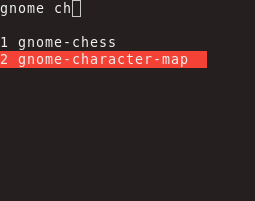
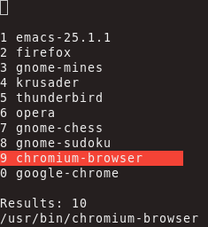

# xstarter

**xstarter is a terminal-based application launcher for Unix-like systems.**

| Branch | Build |
| --- | --- |
|`master`|[](https://travis-ci.org/lchsk/xstarter)|
|`dev`|[](https://travis-ci.org/lchsk/xstarter)|



Searching



Recently open applications

## Features

* a clean, simple interface that works on various terminals
* able to search for applications using environment variables (e.g. `$PATH`) and user-provided list of directories
* can be configured to launch via a key-binding
* remembers previously launched applications allowing to find them more quickly
* allows fuzzy search (parts of the query can be separated with a space)
* applications can be launched with 1, 2, ..., 0 keys, depending on their position in the search results
* fast, uses cache by default
* easy to configure via a single text file
* tested on Ubuntu, Debian, FreeBSD

## Requirements

* ncurses 5.9 / 6.0
* glib > 2.0

### And if you want to compile it yourself

* cmake

## Installation

### Using **deb** package

Download `.deb` package

Run `sudo dpkg -i xstarter-*.deb`

### Using archives

Download `.tar.gz` or `.zip` archive

Extract it

Run `./bin/xstarter` to open the application in the terminal.

### From source

```
git clone https://github.com/lchsk/xstarter/
cd xstarter
cmake .
make
```

Run `./bin/xstarter` to open the application in the terminal.

To install:

```
make install
```

## Running xstarter

**xstarter** needs to be launched from a terminal. It is useful to run it using a key binding, preferably by binding your preferred key to a command starting **xstarter** from a terminal of your choice, e.g. `xterm -e xstarter`. Alternatively, you can simply bind it to `xstarter` in which case xstarter will open itself in a terminal.

You can also create an alias in your shell (e.g. bash, zsh): `alias xs=path-to-xstarter`.

It should run on any modern terminal. It is tested on: `xterm`, `rxvt`, `gnome-terminal`, `xfce4-terminal`, `konsole`. In case of any problems please [report it](https://github.com/lchsk/xstarter/issues/new).

## Configuration

[Configuration file](./xstarter.conf) is available and includes comments that explain configuration variables. It is located in the `~/.xstarter.d/` directory.
